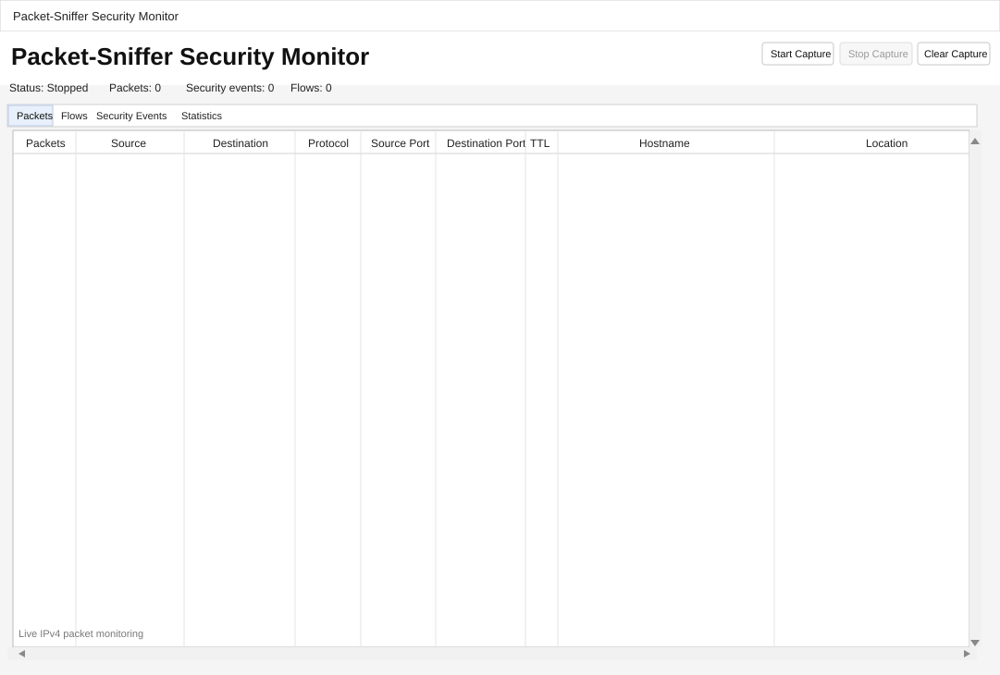

# Packet-Sniffer

**A Python packet sniffer and small network security monitoring tool.**

This project started as a simple packet sniffer and has gradually grown into a desktop application for looking at network traffic, spotting basic patterns and investigating activity that may be worth a closer look.

It captures IPv4 traffic, parses TCP, UDP and ICMP packets, and presents the results through a live GUI.



## Features

- IPv4 packet capture using raw sockets
- TCP, UDP and ICMP packet parsing
- Network flow aggregation
- Bidirectional flow tracking
- Packet, byte and duration statistics
- Live desktop monitoring interface
- Basic security event detection
- Possible port-scan detection
- High-traffic detection
- Reverse DNS lookups
- Optional IP geolocation
- Background network lookups
- Automated tests
- Packet validation and error handling

## GUI

The application currently has four main views:

- **Packets** - live traffic with repeated traffic grouped together
- **Flows** - aggregated bidirectional network flows with packet counts, bytes and duration
- **Security Events** - potentially unusual activity detected during capture
- **Statistics** - a summary of the traffic being observed

Captures can be started, stopped and cleared without restarting the application.

## Security Events

The current detection system looks for a few simple patterns that may be worth investigating:

- High traffic volume
- Possible port scanning activity
- Connections to selected unusual destination ports

These are indicators rather than proof of malicious activity. The detection logic is still fairly basic and will be expanded as the project develops.

## Installation

Clone the repository and install the required dependencies:

```powershell
git clone https://github.com/Matth161002/Packet-Sniffer.git
cd Packet-Sniffer
pip install -r requirements.txt
```

For a clean installation, a virtual environment can also be created:

```powershell
py -m venv .venv
.\.venv\Scripts\python.exe -m pip install -r requirements.txt
```

Raw packet capture on Windows requires administrator privileges. Run the application from an elevated PowerShell window.

## Usage

Start the desktop application with:

```powershell
python security_gui.py
```

If you created a virtual environment without activating it, use:

```powershell
.\.venv\Scripts\python.exe security_gui.py
```

The original command-line sniffer can also be run directly:

```powershell
python Packet_Sniffer.py --count 30
```

## Testing

Tests are written using `pytest`.

Run the test suite with:

```powershell
python -m pytest
```

## Project Structure

```text
Packet-Sniffer/
├── Packet_Sniffer.py
├── packet_capture.py
├── network_lookup.py
├── traffic_analysis.py
├── flow_aggregation.py
├── security_gui.py
└── tests/
    ├── test_packet_parser.py
    ├── test_traffic_analysis.py
    └── test_flow_aggregation.py
```

## Development

The project is still being developed.

The application now combines packet capture, parsing, traffic analysis, security event detection and network flow aggregation in one desktop tool.

Further development will focus on:

- Improved traffic detection
- Filtering and investigation
- Exporting captured data
- Better traffic visualisation

## Responsible Use

Packet-Sniffer is intended for use on networks and systems that you own or have permission to monitor.

See [SECURITY.md](SECURITY.md) for further information.

## Licence

This project is licensed under the MIT License. See [LICENSE](LICENSE) for details.
